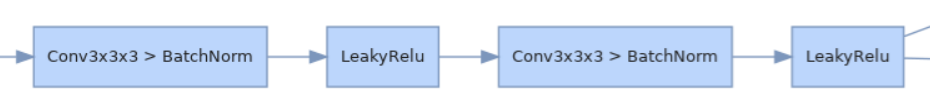
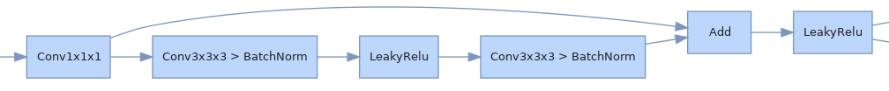
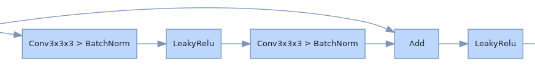
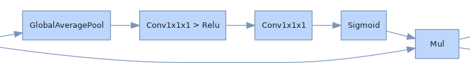

# Modules
- <a href="#DoubleConv">DoubleConv</a>
- <a href="#ResBlock">ResBlock</a>
- <a href="#SElayer3D">SElayer3D</a>
## <a id="DoubleConv">DoubleConv</a>
The standard convolutional structure of [3D U-Net](https://arxiv.org/abs/1606.06650).

## <a id="ResBlock">ResBlock</a>
The residual structure comes from [Superhuman Accuracy on the SNEMI3D Connectomics Challenge](https://arxiv.org/pdf/1706.00120).  
- ResBlock in Encoder
 
- ResBlock in Decoder

## <a id="SElayer3D">SElayer3D</a>
The [SE](https://arxiv.org/pdf/1709.01507) module is implemented in 3D.(reference [torchvision SqueezeExcitation](https://github.com/pytorch/vision/blob/main/torchvision/ops/misc.py))  

